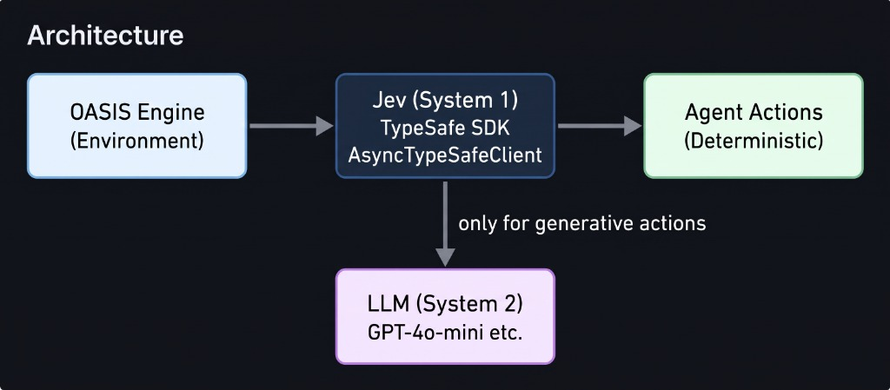

<div align="center">

<h1>Jev-OASIS</h1>
<h3>High-Speed, Ultra-Low-Cost Social Simulation Engine</h3>

<p><em>A fork of <a href="https://github.com/camel-ai/oasis">CAMEL-AI OASIS</a> powered by <a href="https://typesafe.ai">TypeSafe Jev</a> for System 1 fast routing</em></p>

[](https://github.com/badgerbees/jev-oasis)
[](LICENSE)

</div>

______________________________________________________________________

## What is Jev-OASIS?

Jev-OASIS is a fork of CAMEL-AI OASIS that introduces a two-tier cognitive architecture to reduce the API costs of running multi-agent simulations.

### Simulation Costs and the Jev-OASIS Approach

While the OASIS framework itself is open-source, running agents incurs variable API token costs. In a standard setup, every agent queries a Large Language Model (LLM) on every simulation round to determine its next action, which can become expensive at scale.

Jev-OASIS reduces these costs by splitting agent cognition:

1. **System 1 (Jev)**: A fast, low-cost router that handles deterministic decisions (e.g., lurking, liking, following).
1. **System 2 (LLM)**: A standard LLM (e.g., GPT-4o-mini) that is only invoked when System 1 determines the agent must generate original text (e.g., writing a post).

Because most social media behavior is non-generative (scrolling, liking), System 1 handles the majority of actions without consuming expensive LLM tokens.

______________________________________________________________________

## Benchmark Results

In a test with 36 agents over 1 simulation round:

| Metric                 | Jev-OASIS       | Vanilla OASIS |
| ---------------------- | --------------- | ------------- |
| **LLM API Calls**      | 12              | 36            |
| **LLM Call Reduction** | **66.7% fewer** | baseline      |

By escalating to the LLM only when necessary, Jev-OASIS reduced LLM API calls by ~67% compared to the baseline, directly lowering the variable token costs per round.

______________________________________________________________________

## Quick Start

### 1. Install Dependencies

```bash
pip install camel-oasis typesafe-sdk
```

### 2. Set API Keys

Copy the provided `.env.example` to `.env` and configure your API keys:

```bash
cp .env.example .env
```

### 3. Run a Simulation

```python
import asyncio
import os

from camel.models import ModelFactory
from camel.types import ModelPlatformType, ModelType

import oasis
from oasis import (ActionType, LLMAction, ManualAction,
                   generate_reddit_agent_graph)


async def main():
    openai_model = ModelFactory.create(
        model_platform=ModelPlatformType.OPENAI,
        model_type=ModelType.GPT_4O_MINI,
    )

    available_actions = ActionType.get_default_reddit_actions()

    agent_graph = await generate_reddit_agent_graph(
        profile_path="./data/reddit/user_data_36.json",
        model=openai_model,
        available_actions=available_actions,
    )

    db_path = "./data/reddit_simulation.db"
    if os.path.exists(db_path):
        os.remove(db_path)

    env = oasis.make(
        agent_graph=agent_graph,
        platform=oasis.DefaultPlatformType.REDDIT,
        database_path=db_path,
    )

    await env.reset()

    # Seed a post
    actions_1 = {}
    actions_1[env.agent_graph.get_agent(0)] = [
        ManualAction(action_type=ActionType.CREATE_POST,
                     action_args={"content": "What do you think about AI?"})
    ]
    await env.step(actions_1)

    # Let all agents react - Jev routes decisions automatically!
    actions_2 = {
        agent: LLMAction()
        for _, agent in env.agent_graph.get_agents()
    }
    await env.step(actions_2)

    await env.close()

if __name__ == "__main__":
    asyncio.run(main())
```

______________________________________________________________________

## Architecture



### Key Changes from Upstream OASIS

| File                                     | Change                                                                                               |
| ---------------------------------------- | ---------------------------------------------------------------------------------------------------- |
| `oasis/social_agent/agent.py`            | Added `perform_action_by_jev()` and `_build_jev_request()` methods to `SocialAgent`                  |
| `oasis/environment/env.py`               | Added `_perform_batched_jev()` for connection-pooled, concurrent Jev calls via `AsyncTypeSafeClient` |
| `oasis/social_agent/agents_generator.py` | Fixed UTF-8 encoding for Windows compatibility                                                       |
| `pyproject.toml`                         | Added `typesafe-sdk` dependency                                                                      |
| `examples/jev_test.py`                   | Jev-powered simulation example                                                                       |

______________________________________________________________________

## How It Works

1. **Environment builds state** for each agent (persona + feed + recent activity)
1. **Jev evaluates all agents concurrently** through a single `AsyncTypeSafeClient` connection:
   - `Choice`: What action to take? (like, comment, scroll, follow, etc.)
   - `Noul`: Should this be remembered? (0.0 to 1.0 probability)
   - `Score`: Target post/user ID, stance change magnitude
1. **Deterministic actions execute instantly** (like, follow, do_nothing) - zero LLM tokens
1. **Generative actions delegate to LLM** (create_post, create_comment) - constrained prompt with Jev's decision context

______________________________________________________________________

## Upstream

This project is a fork of [CAMEL-AI OASIS](https://github.com/camel-ai/oasis). Full credit to the original authors:

```
@misc{yang2024oasisopenagentsocial,
      title={OASIS: Open Agent Social Interaction Simulations with One Million Agents},
      author={Ziyi Yang and Zaibin Zhang and Zirui Zheng and Yuxian Jiang and Ziyue Gan and Zhiyu Wang and Zijian Ling and Jinsong Chen and Martz Ma and Bowen Dong and Prateek Gupta and Shuyue Hu and Zhenfei Yin and Guohao Li and Xu Jia and Lijun Wang and Bernard Ghanem and Huchuan Lu and Chaochao Lu and Wanli Ouyang and Yu Qiao and Philip Torr and Jing Shao},
      year={2024},
      eprint={2411.11581},
      archivePrefix={arXiv},
      primaryClass={cs.CL},
      url={https://arxiv.org/abs/2411.11581},
}
```

## License

Apache 2.0 - same as upstream OASIS.
